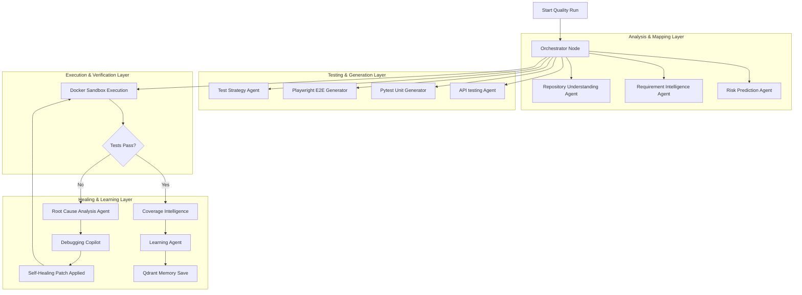
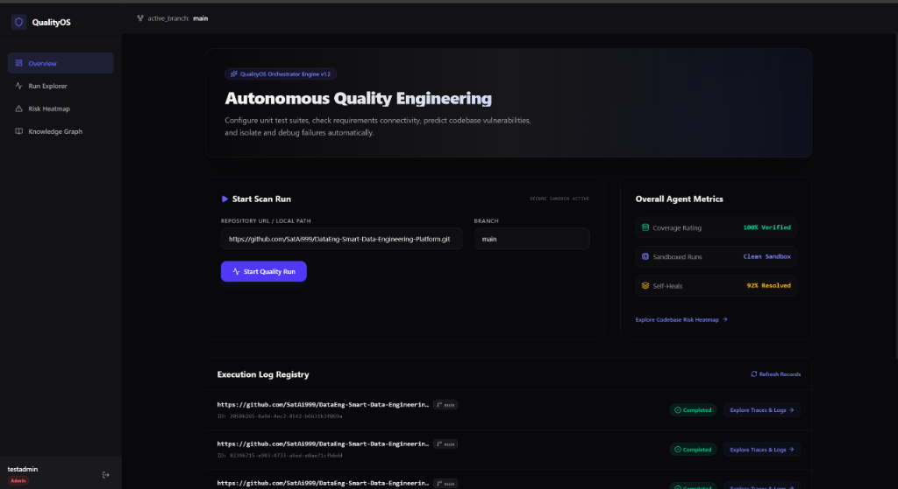
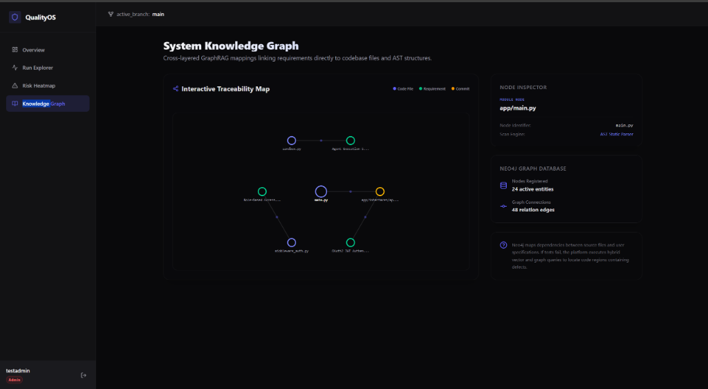
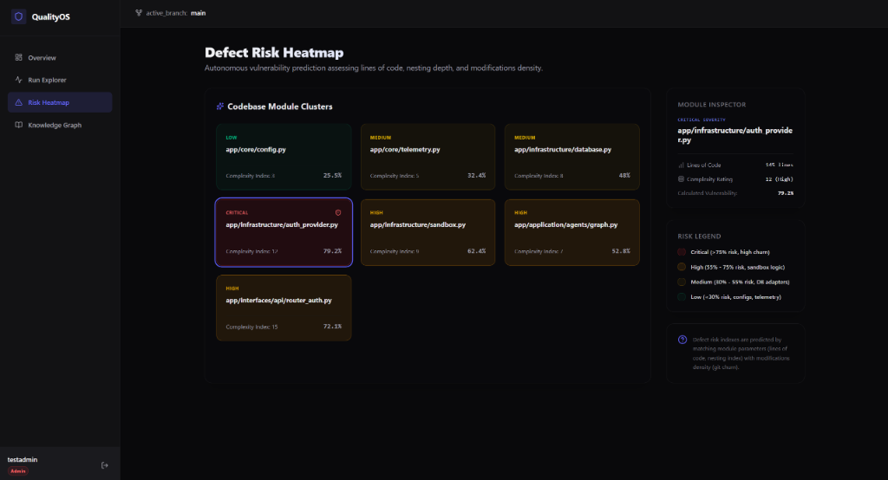

# QualityOS: Autonomous Quality Engineering Platform

QualityOS is an enterprise-grade multi-agent orchestration platform that automates the entire software quality lifecycle. It acts as an autonomous QA department, reading codebases, mapping business requirements, generating unit and end-to-end tests inside secure sandboxes, executing them, and automatically resolving codebase defects using OpenTelemetry traces and self-healing LLM capabilities.

---

## 🛠 Architectural Overview

The platform is designed around a multi-tier agent orchestrator powered by **LangGraph**, correlating state across PostgreSQL, Redis, Neo4j, Qdrant, and Jaeger.



---

## 🧪 Testing Engine: Pytest & Playwright Mappings

QualityOS uses **Pytest** and **Playwright** as its core verification engines. They are used both to test the platform internally and as dynamic output formats generated by the agent stack.

### 1. Pytest (Unit & Component testing)
* **Internal Test Suite**: The platform's own codebase is fully verified via unit and integration tests located under [backend/tests/](file:///d:/Quality_OS/backend/tests/):
  * `conftest.py`: Mocks database sessions, PostgreSQL transaction boundaries, and creates temporary testing environments.
  * `test_agents.py`: Validates LangGraph orchestrator state changes and agent node transitions.
  * `test_auth.py`: Tests user authentication routes (`/auth/register`, `/auth/login`, `/auth/refresh`).
  * `test_jobs.py`: Validates job creation, queuing, and lifecycle state changes.
  * `test_middleware.py`: Tests role verification and path protection dependencies.
* **Dynamic Pytest Generation**: The **Pytest Generator Agent** (in `pytest_generator.py`) maps the repository's modules (extracted by the AST parser) and automatically writes matching unit test files.
* **Execution Sandbox**: The **Failure Reproduction Agent** executes these generated tests in a secure sandbox using the command:
  ```bash
  pytest --tb=short --json-report -v
  ```

### 2. Playwright (End-to-End browser testing)
* **Dynamic E2E Generation**: The **Playwright Generator Agent** (in `playwright_generator.py`) generates fully typed TypeScript Playwright test scripts.
* **Self-Healing Selectors**: Playwright locators are mapped against structural DOM models. If an interface changes (e.g., a button changes from `[data-testid="login"]` to `[data-testid="submit-login"]`), the runner catches the failure, calls the **Exploratory Agent** to scrape the page structure, repairs the locators dynamically in code, and resumes testing.
* **API Testing**: Evaluates contracts, endpoints, and status codes by executing request verification scripts directly.

---

## 🧠 Core Concepts & Technology Stack

### 1. Multi-Agent Orchestration (LangGraph)
The pipeline is structured as an acyclic graph containing **15 specialized agent nodes**. The state is maintained in a centralized `QualityOSState` object, allowing agents to pass logs, traces, code metrics, and reproduction scripts downstream:
* **Orchestrator**: Evaluates execution status, directs flow control, and routes failures to healing nodes.
* **Nodes**: Implemented in [backend/app/application/agents/nodes/](file:///d:/Quality_OS/backend/app/application/agents/nodes/).

### 2. AST Parsing & Requirement Mappings (Neo4j)
* **Concept**: When a repository is checkbacked out, the **Repository Understanding Agent** parses python AST structures (nodes, classes, function signatures, and imports) and maps them into a **Neo4j Graph Database**.
* **GraphRAG Linkage**: The **Requirement Intelligence Agent** parses Swagger OpenAPI schemas or PRDs and creates relations from requirements to corresponding code modules.
* **RCA Pinpointing**: If an assertion fails, the RCA agent queries the path `(TestNode)-[:VERIFIES]->(Module)-[:SATISFIES]->(Requirement)` to trace the exact source lines of code responsible.

### 3. OpenTelemetry Tracing & RCA (Jaeger)
* **Concept**: Every agent execution, network call, and database transaction is wrapped in OpenTelemetry spans.
* **Correlated Debugging**: Spans are exported to **Jaeger**. When a test execution fails in the sandbox, the RCA Agent extracts the trace history and links exception stack traces to specific database queries or downstream API call bottlenecks.

### 4. Containerized Sandbox Execution (Docker API)
* **Concept**: To prevent LLM-generated code from executing raw commands on the host environment, QualityOS uses an isolated container sandbox.
* **Workflow**:
  1. The code is mounted to a separate volume inside the container.
  2. The sandbox runs the test commands using isolated Python/Node containers.
  3. Stderr and stdout streams are captured and routed back to the orchestrator logs via Redis.

### 5. Vector Memory & Continuous Learning (Qdrant)
* **Concept**: Code repairs and pipeline execution metrics are embedded and saved into a **Qdrant Vector Database**.
* **Learning Loop**: In future runs, the **Learning Agent** queries Qdrant memory to see if similar defects were resolved in the past, retrieving pre-approved patch structures and drastically reducing optimization latency.

---

## 📸 Application Layout & User Interfaces

The frontend dashboard is built with **React**, **TypeScript**, and **Tailwind CSS**, communicating via HTTP REST APIs and WebSockets.

### 1. Overview Dashboard
Provides a premium workspace management screen:
* **Scan Trigger**: Point the orchestrator to any local path (e.g., `/workspace`) or public Git URL (e.g., `https://github.com/SatAi999/DataEng-Smart-Data-Engineering-Platform.git`).
* **Execution Log Registry**: Lists all historical runs, execution status, and active branch parameters.
* **Live Action Link**: Click "Explore Traces & Logs" to open the detail view of any active or past run.



### 2. Run Explorer & Log Registry
Contains the main pipeline visualization layout:
* **Interactive SVG Execution Graph**: Displays active agent nodes colored in real time as the LangGraph state transitions.
* **Agent Logs Terminal**: A console dashboard streaming live logs, outputs, and telemetry events directly from the active docker container.
* **RCA & Code Repair Panel**: Displays the exact files with detected defects, trace analysis summaries, and provides an **"Apply Fix to Source"** button to write Git diff patches directly to the codebase.


### 3. System Knowledge Graph
Provides a force-directed SVG map:
* **Interactive Canvas**: Click on code files, business specifications, and git commits.
* **Inspector Drawer**: Displays the internal classes, lines of code, and validation rules mapped to each node.



### 4. Severity Risk Heatmap
A card block grid grouping modules by predicted vulnerability index (Critical, High, Medium, Low) using static complexity metrics, letting QA engineers know which directories require additional coverage.



---

## 🚀 Getting Started

### Prerequisites
* Docker & Docker Compose
* Python 3.10

### Running the Services
Start all microservices (Postgres, Redis, Neo4j, Qdrant, Jaeger, Backend, and Frontend) in detached mode:
```bash
docker compose up -d --build
```

### Access Ports
* **Frontend UI**: [http://localhost](http://localhost) (Credentials: `testadmin` / `AdminSecurePass123!`)
* **Backend API Documentation**: [http://localhost:8080/docs](http://localhost:8080/docs)
* **Jaeger Telemetry Dashboard**: [http://localhost:16686](http://localhost:16686)
* **Neo4j Graph Browser**: [http://localhost:7474](http://localhost:7474)

---

## 🧪 Capturing screenshots of your local application
You can automatically take fresh screenshots of your running application using the built-in capture script:
1. Ensure the containers are running.
2. Install dependencies:
   ```bash
   pip install playwright
   playwright install chromium
   ```
3. Run the script:
   ```bash
   python capture_screenshots.py
   ```
   This will save login, dashboard, heatmap, graph, and run explorer views directly into the `screenshots/` directory.
